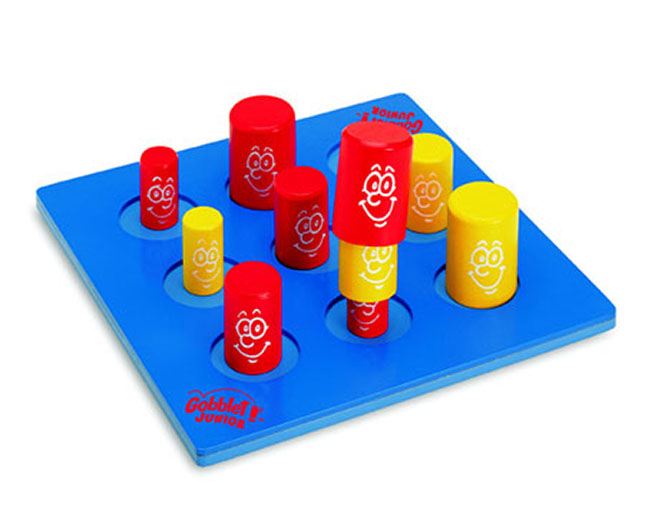

# gobblet-rl

[](https://badge.fury.io/py/gobblet-rl) 
[](https://github.com/elliottower/gobblet-rl/blob/main/LICENSE)

Interactive Multi-Agent Reinforcement Learning Environment for the [Gobblet](https://themindcafe.com.sg/wp-content/uploads/2018/07/Gobblet-Gobblers.pdf) board game using [PettingZoo](https://github.com/PettingZoo-Team/PettingZoo) and [Pygame](https://github.com/pygame/pygame).

Allows for users to play in the same environment, and even play against RL agents trained with [Tianshou](https://github.com/thu-ml/tianshou).

<p align="center">
  
&nbsp; &nbsp; &nbsp; &nbsp;
  
</p> 
 
## Installation

### Using pip (recommended)

```bash
pip install gobblet-rl
```

### Local

```bash
git clone hhttps://github.com/elliottower/gobblet-rl.git
cd gobblet-rl
pip install -e .
```

## Usage

### Setting up a basic environment

In a Python shell, run the following:

```python
from gobblet import gobblet_v1

env = gobblet_v1.env()
```

### Play against a greedy agent

In the terminal, run the following:
```
python gobblet/example_tianshou_DQN.py --cpu-players 1
```

This will launch a game vs a greedy agent, which is a very strong baseline. This agent considers all possible moves with a depth of 2, winning if possible, blocking enemy wins, and even forcing the enemy to make losing moves.

Note: this policy exploits domain knowledge to reconstruct the internal game board from the observation (perfect information) and directly uses functions from `board.py`. Tianshou policies do not get direct access to the environment, only observations/action masks. So the greedy agent should not be directly compared with other RL agents.

### Play against a DQN agent trained with Tianshou

In the terminal, run the following:
```
python gobblet/example_tianshou_DQN.py --epoch 50 --player 1 --cpu-players 2
```

This will train a [DQN](https://tianshou.readthedocs.io/en/master/tutorials/dqn.html) model from Tianshou for 50 epochs, and launch an interactive game against the pre-trained agent. 

Use the argument ``--cpu-player`` to determine the number of CPU agents (1 or 2)  and ``--player`` to choose which agent goes first (human first: 0, CPU first: 1)

### Play an interactive game

In the terminal, run the following:
```
python gobblet/examples/example_user_input.py"
```

Note: Interactive play can be enabled in other scripts using the argument `--num-cpu 1`

To select a piece size, press a number key `1`, `2`, or `3`, or press `space` to cycle through pieces. Placing a piece is done by clicking on a square on the board. A preview will appear showing legal moves with the selected piece size. Clicking on an already placed piece will pick it up and prompt you to place it in a new location (re-placing in the same location is an illegal move).

### Create screen recording of a game

In the terminal, run the following:
```
python gobblet/examples/example_record_game.py"
```
This will save a screen recording of a game to `gobblet/examples/game.gif`


### Watch a game between two basic CPU agents

In the terminal, run the following:
```
python gobblet/examples/example_basic.py"
```
This will launch a game with two basic agents choosing random actions. This file can be used as a starting point for prototyping future methods.


### Command Line Arguments


#### Game Modes

All scripts besides`example_basic.py` (no support for interactive play) take the following arguments:

The default game mode is human vs CPU, with the human playing as red and CPU as yellow. 

 ``--player 1`` sets the human player as yellow, with the CPU moving first as red.

``--cpu-players 1`` will launch a game with one CPU agent and one human agent. (default) 

``--cpu-players 0`` will launch a game with no CPU agents, taking interactive input for both agents. 

``--cpu-player 2`` will launch a game with two CPU agents, and takes no interactive input.


#### Display Modes

`example_basic.py` takes the following arguments to change display mode:

``--render_mode="human" `` will render the game board visually using pygame. Player 1 plays red and goes first, while player 2 plays yellow. 


When playing interactively, possible moves can be previewed by hovering the mouse over each square. To move a piece which is already placed, simply click on it.


``--render_mode="text"`` will render a 3x3 board only showing the topmost pieces (pieces which are covered by others, or 'gobbled', are hidden):
```
TURN: 2, AGENT: player_1, ACTION: 51, POSITION: 6, PIECE: 3
       |       |       
  -    |   -   |   -3  
_______|_______|_______
       |       |       
  -    |   -   |   +2  
_______|_______|_______
       |       |       
  -    |   -   |   -   
       |       |       
```

``--render_mode="text_full"`` will render three different 3x3 boards representing the small, medium and large pieces. This gives full information about pieces which are covered or 'gobbled' by other pieces. :
```
TURN: 3, AGENT: player_0, ACTION: 42, POSITION: 6, PIECE: 5
         SMALL                     MED                     LARGE           
       |       |                |       |                |       |       
  -    |   -   |   -       -    |   -   |   -       -    |   -   |   +5  
_______|_______|_______  _______|_______|_______  _______|_______|_______
       |       |                |       |                |       |       
  -    |   -   |   -2      -    |   -   |   -       -    |   -   |   -   
_______|_______|_______  _______|_______|_______  _______|_______|_______
       |       |                |       |                |       |       
  -    |   -   |   -       -    |   -   |   -       -    |   -   |   -6  
       |       |                |       |                |       |       
```


## Testing

Testing can be done via [pytest](http://doc.pytest.org/):

```bash
git clone https://github.com/elliottower/gobblet-rl.git
cd gobblet-rl
pytest
```
